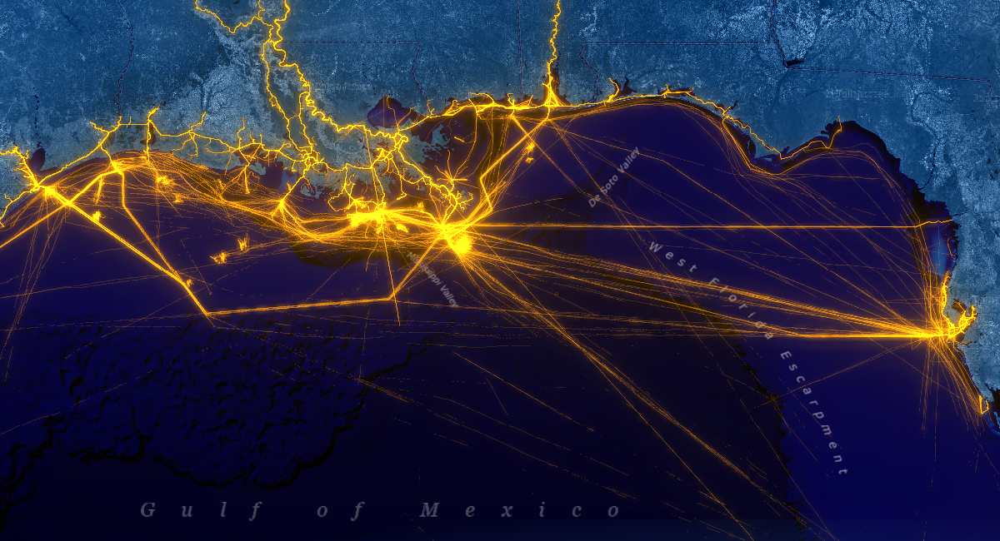

# U.S. Vessel Traffic

This [app](https://livingatlas.arcgis.com/vessel-traffic/) is a new and fun tool that lets you explore the paths of vessels in and around U.S. waters, look for patterns and trends by time, vessel type, and place, and it provides a simple and efficient way to download manageable-sized, area-specific, excerpts



## Installing 
To begin, clone this repository to your computer:

```sh
https://github.com/vannizhang/vessel-traffic.git
```

From the project's root directory, install the required packages (dependencies):

```sh
npm install
```

## Running the app 
Now you can start the webpack dev server to test the app on your local machine:

```sh
# it will start a server instance and begin listening for connections from localhost on port 8080
npm run start
```

## Deployment
To build/deploye the app, you can simply run:

```sh
# it will place all files needed for deployment into the /build directory 
npm run build
```

## Resources
- [ArcGIS Blog - Introducing the U.S. Vessel Traffic application from Living Atlas](https://www.esri.com/arcgis-blog/products/arcgis-living-atlas/data-management/introducing-the-u-s-vessel-traffic-application-from-living-atlas/)
- [Access vessel traffic data](https://www.arcgis.com/home/group.html?id=b094a38a8ebe4017b8f41cc7b0f6be22#overview)

## Issues

Find a bug or want to request a new feature?  Please let us know by submitting an issue.